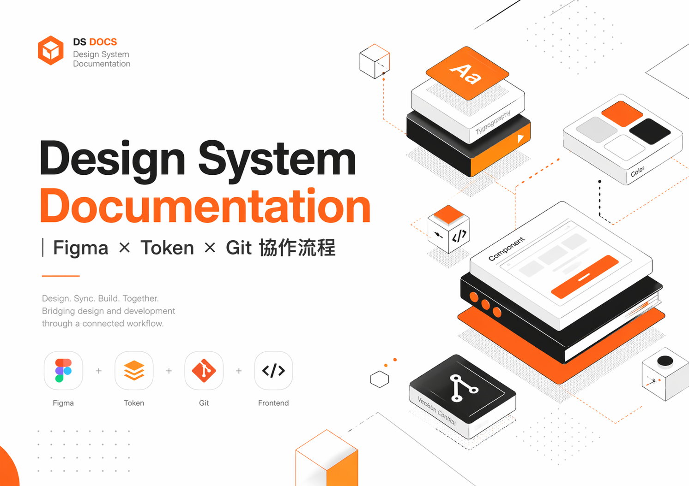

# Design System Documentation｜Figma × Token × Git Workflow

Design System Documentation｜Figma × Token × Git 協作流程 - 結合 Figma Make、Design System、Design Token 與 Git 版本管理方式，研究可串聯前端樣式管理與元件化思維的設計協作流程，讓設計規範不只停留於設計稿，而能以可瀏覽、可維護的方式支援前端開發與跨部門協作

Integrating <entity>Figma Make, Design Systems, Design Tokens, and <entity>Git version control to explore a collaborative design workflow that connects frontend style management with component-based thinking—enabling design guidelines to go beyond static mockups and become browsable, maintainable resources that support frontend development and cross-functional collaboration.

 


## Project Links

- Figma Design System  
  [View Figma File](你的figma連結)

- Figma Make Documentation  
  [View Documentation Demo](你的figma make publish連結)

- UI Kit Source  
  [View UI Kit]([ui kit](https://www.figma.com/design/TSjbCLU9uVC18YhwlUWTBw/Workflow-UI-KIT.))

- Tokens Export Reference  
  JSON Token Export (coming soon)

- GitHub Repository  
  [View Repository](repo網址)

## Repository Structure

```
Design-System-Workflow/
│
├── figma/
│   → Design System source file
│
├── ui-kit/
│   → Published UI Kit structure
│
├── tokens/
│   → JSON token export
│
├── documentation/
│   → Figma Make guideline pages
│
└── version-log/
    → Update tracking
```

## How To Use
此專案主要作為工作流程示範，而非單純 UI Kit
### Step 1 — 在 Figma 建立 Design System
先於 Figma 中建立基礎設計系統。

建議包含：

- Component Library
- Variants
- Variables
- Design Tokens
- 命名規則
- 元件狀態（hover / active / disabled / focus）

此專案以 Tailwind CSS 的思維為基礎，建立可重複使用的結構。

### Step 2 — 建立 Figma Make UI Kit
將 Design System 頁面複製到 Figma Make UI Kit AI。

流程如下：

1. 將 Design System 頁面貼入 Figma Make
2. 生成 UI Kit 結構
3. Publish 成可重複引用的 UI Kit
4. 在其他 Figma Make 專案中重複使用

這樣可以讓 Design System 變成可持續引用的元件來源。

這是 Workflow UI KIT 的程式碼包。原始項目可在以下位置取得：<br>
https://www.figma.com/design/TSjbCLU9uVC18YhwlUWTBw/Workflow-UI-KIT.

### Step 3 — 建立 Documentation 展示頁
使用 Figma Make 建立類似 Bootstrap 的設計規範展示頁。

可展示內容包含：

- Button
- Card
- Form Input
- Dropdown
- Alert
- Badge
- Modal
- Navigation
- Typography
- Color Tokens

文件頁面應包含：

- 視覺展示
- Token 對應
- 元件狀態
- 使用範例
- 規則說明

### Step 4 — 專案檔案結構
此 Repository 可包含以下結構：
```
/design-system-figma
→ 原始 Design System 檔案

/ui-kit
→ Figma Make UI Kit

/tokens
→ Tokens Studio JSON 匯出

/documentation
→ Design Guideline 頁面

/version-log
→ 版本紀錄
```

### Step 5 — 使用 Git 做版本管理

Git 用於追蹤設計規範與文件更新。

版本控制可達成：

- 記錄設計變更
- 比對版本差異
- Token 更新追蹤
- 元件修改紀錄
- 維持團隊設計一致性

比起單純 Figma 檔案，更能建立長期維護流程

## 專案目的
此專案為一個設計文件展示範例，旨在探索如何將以Figma 為基礎的 Design System，轉化為可瀏覽、可維護且具版本控制機制的設計規範網站。
並嘗試將Figma Make、Design System、Design Token 與 Git 版本管理方式結合一起做有效的版本控管，讓設計規範不只停留於設計稿，而能以可瀏覽、可維護的方式支援前端開發與跨部門協作

## 為什麼我建立這個專案
在實際產品團隊中，Figma 設計稿與前端實作之間，經常存在落差與溝通成本。如:
- 設計稿與實際前端瀏覽效果落差
- 元件規範不易查詢
- 工程師需頻繁切換 Figma 與程式碼比對
- 設計變更缺乏可追溯版本紀錄

因此，我嘗試建立一個介於 Design Guideline 與輕量版 Storybook 之間的流程。<br>
此專案旨在探索一套能夠串聯以下元素的協作流程：
- Figma Design System
- Design Tokens／Variables
- 元件規範（Component Guidelines）
- 類似Storybook 的文件化展示方式（Documentation）
- Git 版本控制機制

# 方法與設計思路
此示範專案以 PrimeReact 為基礎的 Design System 作為 UI 架構基底。重點並非從零開始建立每一個元件，而是透過文件化方式，整理元件、Design Token、狀態規則與使用方式，讓設計規範能更有效支援前端協作與系統化管理。<br>

整體流程是以「系統導向的 UI 工作流程」為核心，而非僅停留在視覺設計層面。

我的做法結合過往在 SCSS 元件架構、工具化樣式思維，以及前端友善文件整理上的經驗。整體架構主要受到以下方向影響：
-SCSS 元件組織方式（variables、mixins、可重複使用樣式）
-受Tailwind CSS 啟發的 utility-first 思維
-類似Bootstrap 與Storybook 的元件文件化模式
-Figma Variables 與前端實作之間進行 Design Token 對應管理

不同於將 Design System 視為靜態的 Figma 元件庫，此專案更著重探索如何讓設計規範轉化為可瀏覽、可維護，並具備版本管理概念的文件系統，以支援前端開發與跨部門協作。

# 為什麼採用這樣的結構

在許多專案中，隨著系統規模擴大，<entity>Figma 設計檔往往會變得越來越難維護。<br>

此工作流程旨在探索一種方式，以達成以下目標：<br>

-讓設計決策具備可追溯性
-提升前端閱讀與理解的效率
-降低 UI 設計稿與實際實作之間的不一致性
-支援可擴充、可持續維護的 Design System 管理機制

## Token 與樣式邏輯
設計結構採用分層式邏輯：
Primitive Token
↓
Semantic Token
↓
SCSS Variable Mapping
↓
Tailwind Utility Mapping
↓
Component Usage

此結構有助於降低設計決策與前端實作之間的落差。

## 工作流程
Figma Design System  
→ Figma Variables  
→ Tokens Studio / JSON Tokens  
→ Figma Make Documentation Site  
→ React Export  
→ Git Version Control

## 範圍
目前演示包括：
- Color / Typography / Spacing foundation
- Button component guideline
- Form input guideline
- Component states
- Token mapping
- Version log

## 持續更新中
此專案為持續建置中的示範作品，後續將逐步補充更多元件規範、Token 對應邏輯與設計文件化範例。


## Project Purpose
This project is a design documentation demo built to explore how a Figma-based Design System can be translated into a browsable, maintainable, and version-controlled guideline site.While also experimenting with integrating Figma Make, Design Systems, Design Tokens, and Git version control to create a more effective workflow for managing design updates. The goal is to ensure that design guidelines go beyond static mockups and become browsable, maintainable resources that support frontend development and cross-functional collaboration.


## Why I Built This
In real product teams, Figma files and frontend implementation often have gaps. This demo explores a workflow that connects:
- Figma Design System
- Design Tokens / Variables
- Component Guidelines
- Storybook-style Documentation
- Git Version Control


## Approach

This demo uses an existing PrimeReact-based Design System as its UI foundation. Rather than building every component from scratch, the focus is on documenting how components, design tokens, states, and usage rules can be structured to support frontend collaboration and scalable system design.

The workflow is built from a system-oriented UI perspective rather than a purely visual design process.

My approach combines previous experience with SCSS component architecture, utility-based styling concepts, and frontend-friendly documentation methods. The structure is influenced by:

- SCSS component organization (variables, mixins, reusable styles)
- Utility-first thinking inspired by Tailwind CSS
- Component documentation patterns similar to Bootstrap and Storybook
- Design Token mapping between Figma variables and frontend implementation

Instead of treating a Design System as a static <entity>:contentReference[oaicite:0]{index=0} library, this demo explores how design guidelines can become browsable, maintainable, and version-aware documentation that better supports frontend development and cross-functional collaboration.

## Why This Structure
In many projects, Figma files become difficult to maintain as systems grow.<br>

This workflow explores a way to:<br>
- make design decisions traceable
- improve frontend readability
- reduce inconsistency between UI files and implementation
- support scalable Design System maintenance

## Token & Style Logic
The design structure follows a layered approach: <br>
Primitive Token
↓
Semantic Token
↓
SCSS Variable Mapping
↓
Tailwind Utility Mapping
↓
Component Usage
This structure helps reduce gaps between design decisions and frontend implementation.
## Workflow
Figma Design System  
→ Figma Variables  
→ Tokens Studio / JSON Tokens  
→ Figma Make Documentation Site  
→ React Export  
→ Git Version Control

## Scope
Current demo includes:
- Color / Typography / Spacing foundation
- Button component guideline
- Form input guideline
- Component states
- Token mapping
- Version log

## Work in Progress
This project is a WIP demo and will continue to be updated with more components, token mappings, and documentation examples.
