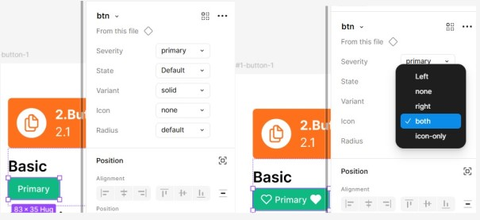

#### 2026-4-29
補充說明：建立variant 修改樣式，可以點選fig檔裡面component切換樣式

 

#### 2026-4-27 
第一次發佈，內容有
- Primitive Color基礎色
- Semantic Color語意色
- Basic style variant 包含
  - Severities
  - state
  - vairant
  - icon
  - radius
 
附上fig檔 & pdf 做紀錄 
